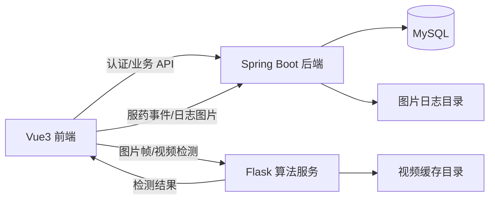
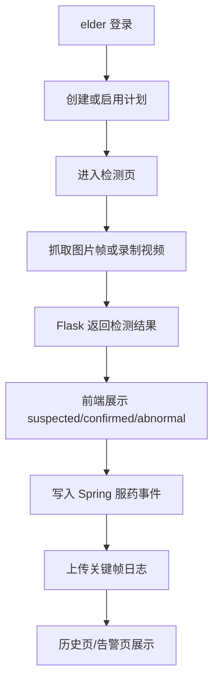

# 项目完善与验证报告

## 1. 系统架构图

## 2. 业务流程图

## 3. 核心接口
- Spring
  - `POST /api/auth/login`
  - `GET /api/patients`
  - `GET /api/patients/current`
  - `GET /api/schedules`
  - `POST /api/intake-events`
  - `POST /api/intake-events/{id}/confirm`
  - `GET /api/alerts`
  - `POST /api/alerts/{id}/resolve`
  - `GET /api/reports/summary`
- Flask
  - `GET /health`
  - `GET /ready`
  - `POST /v1/detections/predict`
  - `POST /v1/detections/video/predict`
  - `POST /v1/videos/upload`

## 4. 数据关系说明
- `patients`：患者主数据，关联 elder 用户。
- `user_patient_relation`：caregiver / child 与患者的关联关系。
- `schedules`：用药计划，当前返回中补充非持久字段 `nextIntake`。
- `intake_events`：服药事件，保存检测结果与确认状态。
- `alerts`：异常/超时告警；当前支持 abnormal 事件触发和时间窗超时补齐。
- `log_images`：关键帧图片日志。

## 5. 已完成项
- 前端 TypeScript 编译错误已修复，`npm run build` 通过。
- 护工端/子女端去除静态占位告警或提醒，改为真实数据或无数据态。
- Spring 返回中补充 `nextIntake`，并将 `missedCount` 改为基于计划窗口的真实计算。
- Spring 在异常事件创建和超时查询时生成告警，在事件确认后自动关闭同计划 pending 告警。
- Flask 默认 `pytest` 可执行，单帧检测不再使用哈希伪输出，而是复用真实 ONNX 推理路径。
- 文档与配置已按实际三服务架构、MySQL 存储、环境变量配置方式修订。

## 6. 当前验证结果
- 前端：`npm run build` 通过。
- Spring：`mvn test` 通过，7 个测试全部成功。
- Flask：`pytest` 通过，7 个测试全部成功。

## 7. 仍需在论文中说明的边界
- 当前统计按“启用计划每天一个时间窗”进行约束化计算，适合课程/毕设原型，不等于完整药学排班引擎。
- 算法部分已接入真实模型，但尚未形成新的数据集训练与完整精度实验表。
- 项目定位为健康辅助原型系统，不应表述为医疗器械级系统。
