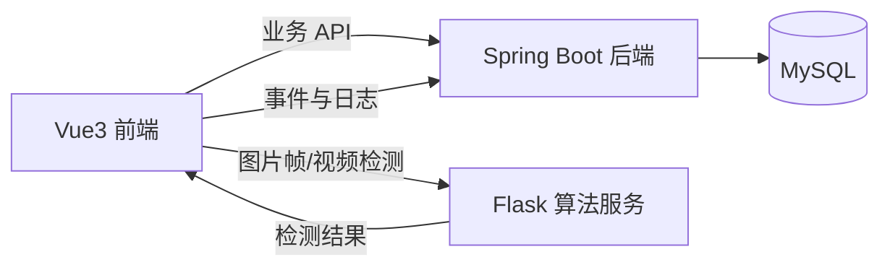

# 论文撰写支撑材料

## 1. 使用说明
- 本文档用于把当前项目整理成可直接写入毕业论文正文的材料。
- 文中内容分为两类：
  - 可直接改写进论文正文的段落和结构化说明。
  - 需要你结合真实实验、个人信息和最终截图再补充的占位项。
- 论文写作时建议优先以本仓库当前实际实现为准，不要继续沿用早期“浏览器端推理、SQLite 存储”的旧描述。

## 2. 绪论素材

### 2.1 研究背景与意义
随着人口老龄化程度不断加深，老年人群体长期服药、慢病共存和服药依从性不足的问题日益突出。许多老年患者存在记忆能力下降、服药时间把握不准确、药物种类繁多等现实困难，容易出现漏服、错服、重复服药等情况。这类问题不仅影响治疗效果，也可能进一步引发慢病控制不稳定、并发症风险上升和家庭照护压力加重。

现有用药提醒方案多以闹钟、纸质记录或移动端消息提醒为主，虽然能够在一定程度上提示服药时间，但通常只能完成“提醒”而无法验证“是否真正完成服药”。尤其在老年用户场景下，单纯的提醒并不能保证服药行为已经发生，护工或子女也难以及时了解老人当天的真实服药情况。因此，构建一个能够同时覆盖“计划管理、行为识别、事件留痕、异常告警和多角色查看”的辅助系统，具有较强的现实价值。

本课题以“基于目标检测的老年人用药提醒与管理系统”为研究对象，尝试将目标检测、轻量动作判定和 Web 信息管理系统结合起来，形成从提醒到记录再到异常追踪的完整闭环。该系统的意义主要体现在三个方面：一是提升老年人日常服药管理的及时性和可追溯性；二是降低护工和子女在远程了解服药状态方面的信息不对称；三是为计算机视觉技术在健康辅助场景中的落地应用提供一个可实现、可验证的原型系统。

### 2.2 国内外研究现状写作脉络
这一部分不建议凭空写死文献结论，而应围绕以下三条主线组织：

1. 智能健康辅助与用药提醒系统研究  
可综述老年人健康管理、慢病管理、家庭照护系统、用药依从性研究等方向，重点说明大多数系统停留在日程提醒、电子病历或消息通知层面，对“真实服药行为验证”支持有限。

2. 目标检测技术在医疗与日常辅助场景中的应用  
可从 YOLO、SSD、Faster R-CNN 等典型目标检测方法谈起，再过渡到小目标识别、实时检测、边缘部署和药品包装识别等应用场景，说明目标检测为服药场景中的药片、药瓶、药盒识别提供了技术基础。

3. 动作识别与行为理解在健康场景中的应用  
可综述基于姿态估计、骨架关键点、时序卷积网络或轻量规则融合的方法，指出复杂动作模型虽然精度高，但在毕设原型系统中往往存在数据成本高、部署复杂、实时性压力大等问题，因此选择轻量关键点规则法更符合本课题条件。

建议在该部分采用“已有研究做了什么、还缺什么、本研究切入点是什么”的写法，并在文中用 `[文献1]`、`[文献2]` 等占位，待你后续检索真实文献后替换。

### 2.3 研究目标与内容
本课题的研究目标是设计并实现一个面向老年人服药场景的 Web 管理系统，使系统不仅能够支持基本的用药计划管理和多角色协同查看，还能结合计算机视觉方法对药品目标和服药动作进行识别，并将识别结果转化为结构化服药事件、图片日志和异常告警。

围绕该目标，本文主要开展以下工作：
- 分析老年人、护工和子女三类用户在服药管理场景中的核心需求，完成需求建模与角色权限划分。
- 设计前端、业务后端和算法服务协同的三层系统架构，实现计划管理、检测识别、历史记录、统计分析和告警处理等功能模块。
- 采用 YOLO 目标检测与轻量动作规则融合方案，对药品目标和服药动作进行识别，并建立统一的检测结果协议。
- 通过功能测试、自动化测试和场景验收，对系统可运行性、业务闭环和可追溯性进行验证，并总结当前系统的边界与改进方向。

### 2.4 论文组织结构
可以直接写成如下形式：

第一章介绍课题的研究背景、研究意义、国内外研究现状以及本文的研究目标与主要内容。  
第二章对系统相关技术进行分析，包括 Vue3 前端技术、Spring Boot 后端技术、Flask 算法服务、MySQL 数据存储以及目标检测与动作判定相关方法。  
第三章完成系统需求分析与总体设计，给出用户角色、功能模块、系统架构和数据库设计。  
第四章详细阐述系统的实现过程，包括前端页面实现、后端业务逻辑实现、算法接口设计以及关键流程实现。  
第五章对系统进行测试与分析，给出功能测试、自动化测试、场景验收和算法实验的结果，并分析系统的不足。  
第六章总结全文研究工作，并对后续改进方向进行展望。

## 3. 系统设计与实现素材

### 3.1 系统总体架构
本系统采用前后端分离并结合独立算法服务的三服务架构。前端使用 Vue3、Vite 和 TypeScript 构建，负责页面交互、摄像头录制、检测结果展示以及多角色界面管理；业务后端使用 Spring Boot、MyBatis-Plus 和 MySQL，负责用户认证、患者关联、用药计划、服药事件、告警和统计等核心业务；算法服务使用 Flask、ONNX Runtime 和 OpenCV，负责单帧检测、视频检测和模型就绪检查。三者协同形成“前端采集数据、算法服务完成识别、业务后端负责持久化和管理”的完整闭环。

你可以配合以下架构图使用：

### 3.2 技术选型与理由
可直接采用下表：

| 层次 | 技术 | 选择理由 |
| --- | --- | --- |
| 前端 | Vue3 + Vite + TypeScript + Pinia + Naive UI | 组件化能力强，开发效率高，便于构建多角色 Web 界面，并具备较好的类型约束能力 |
| 业务后端 | Spring Boot 3 + Spring Security + MyBatis-Plus | 适合快速实现 REST API、权限控制和业务分层，生态成熟，便于管理计划、事件和告警逻辑 |
| 数据库 | MySQL | 关系型结构清晰，适合管理用户、患者、计划、事件、日志和告警等结构化数据 |
| 算法服务 | Flask + ONNX Runtime + OpenCV + MediaPipe | 轻量、易部署，便于将训练好的模型接入服务端推理链路，并支持图像解码和关键点处理 |
| 模型训练 | YOLOv8 训练脚本与 ONNX 导出 | 适合小目标实时检测，部署成本较低，便于在毕设场景中实现从训练到部署的完整闭环 |

### 3.3 功能模块说明
系统可划分为以下模块：
- 用户与认证模块：完成注册、登录、角色识别和权限控制。
- 患者与关联模块：管理老年人信息，以及护工、子女与患者之间的关联关系。
- 用药计划模块：支持药品类型、剂量、频次、时间窗和周期等信息维护，并提供计划启停。
- 检测识别模块：采集图像帧或视频，调用算法服务完成药品与动作识别。
- 事件与日志模块：将识别结果落库为结构化服药事件，并保存关键帧图片。
- 异常告警模块：对异常事件和超时未确认事件生成告警。
- 统计报表模块：统计服药记录、漏服情况和计划执行概况。

### 3.4 关键业务流程
可直接写为：

当老年用户登录系统后，首先可以创建或启用当天的用药计划；当计划进入对应时间窗后，用户进入检测页面并开启摄像头录制；前端将图像帧或视频数据提交给 Flask 算法服务进行检测；算法服务返回药品目标、动作结果和综合状态；前端再将检测结果转换为服药事件写入 Spring 后端，并上传关键帧图片；如果事件为异常，或者在时间窗结束后仍未形成确认记录，后端会生成相应告警；护工与子女登录后可查看相同患者的历史记录、告警状态和计划执行情况。

## 4. AI 模型与研究方法素材

### 4.1 目标检测模型
在目标检测部分，系统采用 YOLO 系列轻量检测思路，将药品相关对象划分为 `PILL`、`BLISTER`、`BOTTLE`、`BOX` 四类。YOLO 模型具有单阶段检测、推理速度快和部署灵活等特点，适合家庭场景中对药品小目标进行实时识别。训练完成后，模型被导出为 ONNX 格式，并部署在 Flask 算法服务中，以服务端推理的方式向前端提供统一的检测接口。

### 4.2 动作判定方法
在动作识别部分，系统没有引入复杂的视频行为识别网络，而是采用了“手部关键点检测 + 距离规则判定”的轻量方法。该方法首先尝试获取手部关键点，再根据手部与口部的相对位置关系判断是否存在“送药入口”的动作趋势。相比完整动作识别网络，该方案的优势在于数据需求较小、部署开销较低、判定逻辑清晰，适合毕业设计中的原型系统实现。

### 4.3 数据采集与标注写法模板
你可以按下面的结构填充真实数据：

- 数据来源：本课题所用数据包括药品静态图像和服药动作视频两部分，主要通过普通 PC 摄像头在室内环境下采集。
- 采集环境：包括桌面、卧室、客厅等家庭常见场景，覆盖自然光、室内灯光、不同背景和一定程度遮挡情况。
- 目标检测标注：采用矩形框方式对药片、泡罩板、药瓶和药盒进行标注，标注格式为 YOLO 标准格式。
- 动作样本标注：通过关键帧区间或视频片段对服药动作发生区间进行记录，用于动作规则验证。
- 数据划分：训练集、验证集、测试集按照 `7:2:1` 或实际比例划分，并尽量保证场景和人员不交叉。

### 4.4 模型训练写法模板
本系统使用 YOLOv8 训练脚本对药品目标检测模型进行训练，训练过程中设置模型规模、训练轮数、批大小和图像尺寸等参数，并根据验证集结果选择最佳权重文件。完成训练后，将模型导出为 ONNX 格式，并复制到 Flask 服务的模型目录中，用于后续检测部署。

这一段你需要补充以下实测内容：
- 训练硬件环境：例如 CPU、GPU、内存、操作系统。
- 训练参数：epochs、batch、imgsz、学习率。
- 训练结果：mAP@0.5、Precision、Recall、Loss 变化。
- 对比实验：如有，可对比不同模型规模或不同阈值下的结果。

### 4.5 事件判定与系统映射
算法服务输出 `suspected`、`confirmed`、`abnormal` 三种状态。业务层将这些状态映射为服药事件、图片日志和异常告警。其中，`suspected` 通常表示系统已经发现部分证据但仍需进一步确认；`confirmed` 表示系统检测到药品目标与服药动作同时成立，可直接形成较高可信的服药事件；`abnormal` 表示未检测到有效服药行为或出现异常情况，应记录为异常事件并纳入后续告警跟踪。

## 5. 数据库设计素材

### 5.1 实体与关系
系统数据库采用 MySQL 存储，核心实体包括用户、患者、患者关联关系、用药计划、服药事件、告警、日志图片和个人设置等。其设计目标是在满足多角色查看与事件追踪的前提下，实现数据结构清晰、关系明确和便于统计查询。

可按如下关系描述：
- `users` 存储系统账号及角色信息。
- `patients` 存储老年用户对应的患者信息。
- `user_patient_relation` 存储护工、子女与患者的关联关系。
- `schedules` 存储用药计划，是事件与统计的基础。
- `intake_events` 存储每一次服药检测或确认结果。
- `alerts` 存储异常事件和超时未确认事件对应的告警信息。
- `log_images` 存储与服药事件绑定的关键帧图片信息。
- `settings` 存储用户偏好和隐私设置。

### 5.2 表结构说明模板
你可以在论文中整理成表格，下面是简化版描述：

| 表名 | 作用 | 关键字段 |
| --- | --- | --- |
| `users` | 用户账号表 | `id`、`username`、`pwd_hash`、`role` |
| `patients` | 患者表 | `id`、`elder_user_id`、`name` |
| `user_patient_relation` | 用户与患者关联表 | `id`、`user_id`、`patient_id`、`relation_type` |
| `schedules` | 用药计划表 | `id`、`patient_id`、`type`、`dose`、`freq`、`win_start`、`win_end`、`period`、`status` |
| `intake_events` | 服药事件表 | `id`、`patient_id`、`schedule_id`、`ts`、`status`、`action`、`targets_json`、`img_url` |
| `alerts` | 告警表 | `id`、`patient_id`、`type`、`title`、`ts`、`status` |
| `log_images` | 图片日志表 | `id`、`event_id`、`url`、`ts` |
| `settings` | 用户设置表 | `id`、`user_id`、`privacy`、`notify_config` |

## 6. 前端适老化设计素材
由于系统目标用户包含老年人，界面设计遵循“清晰、稳定、低认知负担”的原则。具体设计思路包括：使用较大的标题字号和按钮尺寸，减少单页操作步骤，采用高对比度配色和清晰状态反馈，避免复杂嵌套导航，同时在检测页面中使用状态条、步骤提示和操作清单帮助用户理解当前流程。对于护工和子女端，则更强调信息概览和历史回溯，避免暴露不必要的编辑入口，从而降低误操作风险。

如果论文需要更细，可以补一句：前端在检测页中通过状态卡片、步骤引导和错误提示机制，引导用户完成“开启摄像头、录制视频、查看检测结果、确认服药”的顺序化操作，以适应老年用户对连续任务的理解特点。

## 7. 系统测试与性能评估素材

### 7.1 测试策略
系统测试主要从三个层面展开：第一，前端工程构建验证，确保 Vue 项目能够正常编译和打包；第二，后端与算法服务自动化测试，验证计划、事件、告警、统计和检测接口等关键逻辑；第三，端到端业务场景验收，验证从登录、创建计划、进行检测到形成历史记录与告警的完整业务闭环。

### 7.2 当前可直接写入的验证结果
截至当前版本，项目已完成以下自动化验证：
- 前端执行 `npm run build` 已通过，说明主要 TypeScript 类型错误和构建问题已修复。
- Spring Boot 后端执行 `mvn test` 已通过，共 7 个测试，覆盖了计划时间计算、漏服统计、异常事件与告警逻辑等关键模块。
- Flask 算法服务执行 `pytest` 已通过，共 7 个测试，说明默认测试链路可运行，检测接口与异常路径已具备基础校验能力。
- Flask 性能片段测试可输出推理耗时参考值，但该结果更适合用于实验环境记录，不宜直接作为最终论文中的算法性能结论。

### 7.3 建议写入论文的功能验收场景
- 老年用户登录后创建或启用用药计划。
- 在计划时间窗内进入检测页面，完成一次视频录制与检测。
- 系统生成 `suspected`、`confirmed` 或 `abnormal` 状态之一，并写入服药事件。
- 系统保存关键帧图片，并在历史页面中可查询到相应记录。
- 若时间窗结束仍未确认服药，系统在告警查询中补齐超时告警。
- 护工和子女可查看被关联患者的记录和告警，但无编辑权限。

### 7.4 结果分析写法建议
你可以按以下方式写：

从系统级测试结果看，当前版本已经具备较完整的业务闭环，能够支持用户计划管理、检测记录、历史查看和异常追踪等核心功能。前端构建通过、后端测试通过和算法服务测试通过，说明系统在工程层面具备较好的可运行性和可维护性。  
但从算法研究角度看，当前项目虽然已接入真实 ONNX 模型并形成统一检测协议，但尚需结合自建数据集和标准测试集进一步补充精度实验，例如 `mAP@0.5`、Precision、Recall、动作识别准确率和端到端延迟等指标，以增强论文在实验验证层面的完整性。

## 8. 结论与展望素材

### 8.1 结论模板
本文围绕老年人日常服药管理问题，设计并实现了一套基于目标检测的老年人用药提醒与管理系统。系统从需求分析出发，完成了老年人、护工和子女三类角色建模，构建了 Vue3 前端、Spring Boot 业务后端和 Flask 算法服务协同的三服务架构，实现了用药计划管理、图像与视频检测、服药事件留痕、异常告警和多角色查看等功能。项目当前已完成核心业务链路和自动化验证，能够作为健康辅助场景下的实验系统原型，为计算机视觉技术与健康管理应用结合提供实践基础。

### 8.2 不足与展望模板
本系统仍存在以下不足：一是算法部分虽然实现了真实模型接入，但尚未基于大规模自建数据集完成完整精度评估；二是动作判定当前以轻量规则融合为主，在复杂遮挡、光照变化和多人体干扰场景下仍有改进空间；三是系统部署仍偏向本机开发和答辩演示环境，尚未扩展到更完善的生产化部署、消息推送和移动端支持。未来可在数据集扩充、动作识别建模、跨端适配、异常提醒方式和隐私保护策略等方面继续深入研究。

## 9. 附录建议
以下内容可作为论文附录：
- 核心接口清单。
- 主要数据库表结构。
- 关键代码片段，例如检测结果协议、计划时间计算、告警生成逻辑。
- 系统页面截图与关键流程截图。
- 训练参数配置和实验结果表。

## 10. 封面与基础信息模板
你可以先按以下模板准备：

| 项目 | 内容 |
| --- | --- |
| 学院 | 待填写 |
| 年级 | 待填写 |
| 专业 | 待填写 |
| 学号 | 待填写 |
| 学生姓名 | 待填写 |
| 指导教师 | 待填写 |
| 指导教师职称 | 待填写 |
| 论文题目 | 基于目标检测的老年人用药提醒与管理系统的设计与实现 |
| 提交日期 | 例如 2025 年 5 月 |

## 11. 参考文献准备建议
这一部分我不建议直接替你捏造文献条目，建议你按以下方向检索并整理：
- 老年人用药依从性、慢病管理、家庭照护相关研究。
- 目标检测算法综述与 YOLO 系列论文。
- 姿态估计、关键点检测、MediaPipe Hands 相关研究。
- 医疗健康辅助系统、智能提醒系统、人机交互适老化设计相关研究。

建议最终至少准备三类文献：
- 理论与综述类文献。
- 目标检测与动作识别方法类文献。
- 健康辅助与适老化系统应用类文献。
