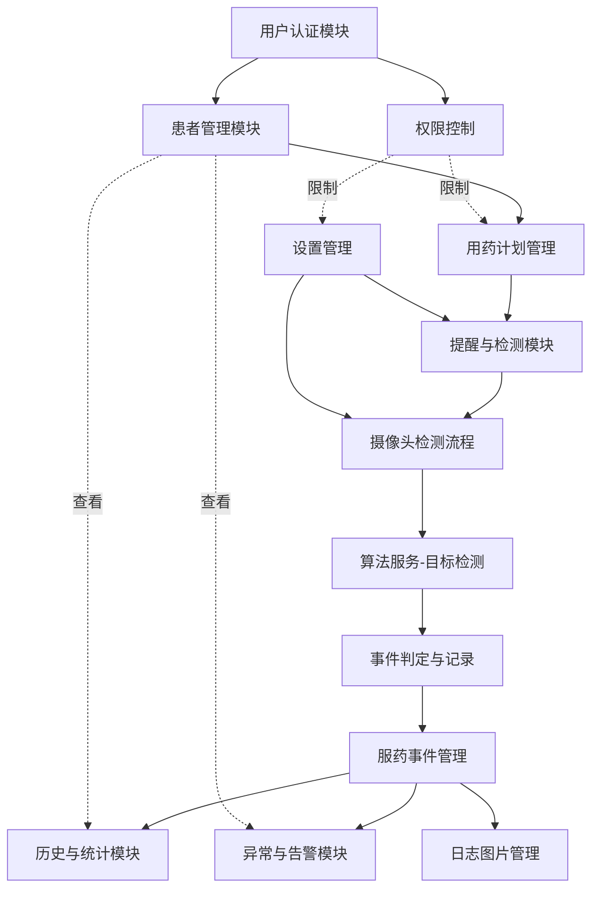

# 基于目标检测的老年人用药提醒与管理系统 - 功能关联分析报告

**生成日期**: 2025-11-16  
**项目架构**: Vue3前端 + Spring Boot后端 + Flask算法服务

---

## 📊 一、系统整体架构概览

### 1.1 三层架构关系

```
┌─────────────────────────────────────────────────────────────┐
│                    前端层（Vue3 + TypeScript）                │
│  - 用户界面与交互                                              │
│  - 摄像头权限管理                                              │
│  - 端侧帧捕获与预处理                                          │
└──────────────┬──────────────────────────────────────────────┘
               │ HTTP REST API
               │ (JWT Bearer Token)
┌──────────────▼──────────────────────────────────────────────┐
│                  后端层（Spring Boot + MySQL）                │
│  - 业务逻辑处理                                                │
│  - 权限控制（elder/caregiver/child）                          │
│  - 数据持久化                                                  │
│  - 图片文件存储                                                │
└──────────────┬──────────────────────────────────────────────┘
               │ HTTP POST /v1/detections/predict
               │ (Base64图片帧)
┌──────────────▼──────────────────────────────────────────────┐
│                 算法服务层（Flask + ONNX Runtime）             │
│  - 药品目标检测（YOLO）                                        │
│  - 吃药动作识别（规则/轻量模型）                               │
│  - 返回检测结果与置信度                                        │
└─────────────────────────────────────────────────────────────┘
```

---

## 🔗 二、核心功能模块关联关系

### 2.1 功能模块关联图



---

## 🎯 三、功能模块详细关联分析

### 3.1 用户认证模块（Authentication Module）

**位置**：
- 前端：`authService.ts`, `auth.ts` (Pinia store)
- 后端：`AuthController.java`, `JwtTokenProvider.java`

**核心功能**：
- 用户注册（register）
- 用户登录（login）
- 获取用户信息（profile）

**关联关系**：
1. **→ 患者管理模块**：登录后根据角色（elder/caregiver/child）加载对应的患者列表
2. **→ 权限控制**：JWT Token携带角色信息，后端所有接口依赖此进行权限校验
3. **→ 路由守卫**：前端router通过认证状态决定页面跳转

**因果关系**：
- **因**：用户登录成功 → **果**：获得JWT Token → **果**：可访问受保护的API
- **因**：角色为elder → **果**：可访问计划编辑、设置管理等写权限页面
- **因**：角色为caregiver/child → **果**：仅能查看数据，无法编辑

---

### 3.2 患者管理模块（Patient Management）

**位置**：
- 前端：`patientService.ts`, `patient.ts` (Pinia store), `usePatientList.ts`
- 后端：`PatientController.java`, `Patient.java`
- 数据库：`patients` 表

**核心功能**：
- 获取患者列表（GET /api/patients）
- 获取患者详情（GET /api/patients/{id}）

**关联关系**：
1. **← 用户认证**：通过JWT Token识别当前用户
2. **→ 用药计划**：患者详情中包含关联的用药计划摘要（最近5条）
3. **→ 告警模块**：患者详情中包含最近告警（最近5条）
4. **→ 护工/子女仪表板**：多角色查看依赖`user_patient_relation`表的关联关系

**因果关系**：
- **因**：elder角色登录 → **果**：返回自己的患者信息（通过`elder_user_id`关联）
- **因**：caregiver/child角色登录 → **果**：返回关联的患者列表（通过`user_patient_relation`表）
- **因**：选择患者 → **果**：其他模块（计划、历史、告警）按patientId过滤数据

**数据流**：
```
用户登录(userId) 
  → 查询user_patient_relation表（caregiver/child）或 patients表（elder）
  → 返回患者列表(patientId[])
  → 前端Pinia store保存当前选中患者
  → 其他API请求携带patientId参数
```

---

### 3.3 用药计划管理模块（Schedule Management）

**位置**：
- 前端：`planService.ts`, `PlanBoardView.vue`
- 后端：`ScheduleController.java`, `Schedule.java`
- 数据库：`schedules` 表

**核心功能**：
- 查询计划列表（GET /api/schedules?patientId={id}）
- 创建计划（POST /api/schedules）
- 更新计划（PATCH /api/schedules/{id}）
- 启停计划（POST /api/schedules/{id}/toggle）

**关联关系**：
1. **← 患者管理**：必须指定patientId才能查询/创建计划
2. **→ 提醒与检测**：计划的时间窗（winStart, winEnd）决定何时触发提醒
3. **→ 服药事件**：每次检测记录都关联一个scheduleId
4. **→ 算法服务**：药品类型（type: PILL/BLISTER/BOTTLE/BOX）影响检测目标

**因果关系**：
- **因**：创建计划且status=enabled → **果**：到达时间窗时前端触发语音提醒
- **因**：计划启用 → **果**：检测页面可选择该计划进行检测
- **因**：计划暂停（status=disabled） → **果**：不再触发提醒，检测结果不关联此计划

**权限控制**：
- elder角色：可读可写（CRUD）
- caregiver/child角色：仅可读

---

### 3.4 提醒与检测模块（Reminder & Detection）

**位置**：
- 前端：`DetectionRoomView.vue`, `useCameraDetection.ts`, `detectionService.ts`
- 算法服务：`detection.py`, `detector.py`

**核心功能**：
- 定时提醒（前端计时器 + 语音播报）
- 摄像头权限管理
- 实时帧捕获与推理

**关联关系**：
1. **← 用药计划**：根据计划时间窗触发提醒
2. **← 设置管理**：提醒音量、语音开关、检测模式等配置
3. **→ 算法服务**：将帧数据（Base64）发送到Flask服务进行推理
4. **→ 服药事件**：检测结果触发事件创建

**数据流程**：
```
1. 前端定时检查计划时间窗 → 到达时间窗
2. 触发语音提醒（TTS）
3. 用户点击"开启检测" → 请求摄像头权限
4. 权限授予 → 视频流开始
5. 循环：captureFrame → 转Base64 → POST /v1/detections/predict
6. 算法服务返回结果：
   {
     status: 'suspected' | 'confirmed' | 'idle',
     targetDetected: true/false,
     actionDetected: true/false,
     targets: [{label, score, bbox}],
     confidence: 0.95
   }
7. 前端判断：
   - 两者都检测到 → 状态：suspected（疑似已服药）
   - 仅一者检测到 → 提示：请对准药品/请靠近口部
   - 用户点击"确认已服药" → 调用后端确认接口
```

**因果关系**：
- **因**：时间窗到达 → **果**：语音提醒播报
- **因**：摄像头检测到药品+动作 → **果**：触发"疑似已服药"状态
- **因**：用户手动确认 → **果**：事件状态更新为confirmed，记录确认人和确认时间

---

### 3.5 算法服务模块（Algorithm Service）

**位置**：
- 算法服务：`flask-project/app/routers/v1/detection.py`
- 推理引擎：`detector.py`, `image_loader.py`

**核心功能**：
- 健康检查（GET /health）
- 就绪检查（GET /ready）
- 检测预测（POST /v1/detections/predict）

**输入输出**：
```json
// 输入（DetectionRequest）
{
  "patientId": "1",
  "scheduleId": "1",
  "timestamp": "2024-11-15T08:30:00Z",
  "frameB64": "base64编码的图片帧",
  "cameraId": "web-cam",
  "modelVersion": "web-yolo-v1"
}

// 输出（DetectionResponse）
{
  "status": "suspected",
  "confidence": 0.95,
  "actionDetected": true,
  "targetDetected": true,
  "targets": [
    {"label": "PILL", "score": 0.95, "bbox": [x1, y1, x2, y2]}
  ],
  "latencyMs": 85,
  "traceId": "550e8400-e29b-41d4-a716-446655440000"
}
```

**关联关系**：
1. **← 检测模块**：接收前端发送的帧数据
2. **→ 检测模块**：返回推理结果
3. **独立部署**：与后端解耦，可独立扩展

**技术栈**：
- ONNX Runtime Web（端侧推理）或 Flask后端推理
- YOLOv8/YOLOv5用于药品检测
- MediaPipe/规则融合用于动作识别

---

### 3.6 服药事件管理模块（Intake Event Management）

**位置**：
- 前端：`historyService.ts`, `HistoryCenterView.vue`
- 后端：`IntakeEventController.java`, `IntakeEvent.java`
- 数据库：`intake_events` 表

**核心功能**：
- 查询事件列表（GET /api/intake-events?patientId={id}&range={day/week/month}）
- 创建事件（POST /api/intake-events）
- 确认事件（POST /api/intake-events/{id}/confirm）

**关联关系**：
1. **← 检测模块**：检测结果触发事件创建
2. **← 用药计划**：事件关联scheduleId
3. **→ 日志图片**：事件关联imgUrl和log_images表
4. **→ 统计报表**：事件数据是统计分析的基础

**事件状态机**：
```
初始检测
   ↓
suspected（疑似已服药）
   ↓ 用户手动确认
confirmed（已确认）

或者

suspected
   ↓ 超时未确认
abnormal（异常）
```

**因果关系**：
- **因**：算法返回targetDetected=true + actionDetected=true → **果**：创建suspected事件
- **因**：用户点击"确认已服药" → **果**：事件状态更新为confirmed，记录confirmedBy和confirmedAt
- **因**：超时未确认 → **果**：创建异常告警，事件状态可能标记为abnormal

**数据字段说明**：
- `ts`：事件时间戳（ISO8601格式）
- `status`：suspected/confirmed/abnormal
- `action`：动作描述（如"hand_to_mouth"）
- `targetsJson`：JSON字符串，存储检测到的药品目标和置信度
- `imgUrl`：关键帧图片URL
- `confirmedBy`：确认人（用户名）
- `confirmedAt`：确认时间

---

### 3.7 历史与统计模块（History & Reports）

**位置**：
- 前端：`historyService.ts`, `HistoryCenterView.vue`
- 后端：`IntakeEventController.java`, `ReportController.java`

**核心功能**：
- 查询事件列表（按日/周/月）
- 统计报表（GET /api/reports/summary?patientId={id}&range={day/week/month}）

**统计指标**：
```json
{
  "patientId": 1,
  "range": "week",
  "totalReminders": 21,        // 总提醒次数
  "confirmedCount": 18,         // 已确认次数
  "confirmRate": 0.857,         // 确认率
  "avgResponseTime": 125,       // 平均响应时间（秒）
  "abnormalCount": 3,           // 异常次数
  "missedCount": 0              // 漏服次数
}
```

**关联关系**：
1. **← 服药事件**：所有统计基于intake_events表的数据
2. **→ 可视化图表**：前端使用统计数据渲染图表

**因果关系**：
- **因**：确认事件增多 → **果**：confirmRate上升
- **因**：超时未确认 → **果**：abnormalCount增加
- **因**：计划时间窗到达但无事件记录 → **果**：missedCount增加

---

### 3.8 异常与告警模块（Alerts Module）

**位置**：
- 前端：`alertService.ts`, `AlertCenterView.vue`
- 后端：`AlertController.java`, `Alert.java`
- 数据库：`alerts` 表

**核心功能**：
- 查询告警列表（GET /api/alerts?patientId={id}）
- 标记已处理（POST /api/alerts/{id}/resolve）

**告警类型**：
- `timeout`：超时未确认
- `detection_failed`：检测服务异常
- `missed_dose`：漏服提醒

**告警触发逻辑**（需要在后端或前端实现）：
```
1. 时间窗结束后N分钟（如30分钟）无确认事件 → 创建timeout告警
2. 检测服务连续失败 → 创建detection_failed告警
3. 每日统计发现漏服 → 创建missed_dose告警
```

**关联关系**：
1. **← 服药事件**：超时未确认触发告警
2. **← 检测模块**：检测服务异常触发告警
3. **→ 护工/子女仪表板**：告警列表在仪表板高亮显示

**因果关系**：
- **因**：时间窗结束后30分钟无确认 → **果**：创建告警（severity=high）
- **因**：护工/子女查看告警 → **果**：告警在前端高亮提示
- **因**：点击"标记已处理" → **果**：告警状态更新为resolved，记录resolvedAt和actionNote

---

### 3.9 日志图片管理模块（Log Images）

**位置**：
- 前端：`logService.ts`
- 后端：`LogImageController.java`, `FileStorageUtil.java`
- 数据库：`log_images` 表
- 文件系统：`/logs` 目录

**核心功能**：
- 上传图片（POST /api/logs/images，multipart/form-data）
- 查询图片列表（GET /api/logs/images?eventId={id}）

**文件存储策略**：
```
/logs/
  └── 20241115_083000_event1.jpg
  └── 20241115_083005_event1.jpg
  └── ...
```

**关联关系**：
1. **← 检测模块**：关键帧捕获后上传
2. **← 服药事件**：图片URL存储在intake_events.img_url字段
3. **→ 历史详情**：查看事件时展示关联图片

**因果关系**：
- **因**：检测到疑似服药 → **果**：捕获关键帧并上传
- **因**：上传成功 → **果**：返回图片URL，存储到事件记录
- **因**：查看历史详情 → **果**：通过eventId查询关联图片列表

**图片处理规范**：
- 格式：JPG/PNG/WEBP
- 大小：≤2MB
- 验证：前端和后端双重校验

---

### 3.10 设置管理模块（Settings Management）

**位置**：
- 前端：`settingsService.ts`, `SettingsCenterView.vue`
- 后端：`SettingsController.java`, `Settings.java`
- 数据库：`settings` 表

**核心功能**：
- 获取设置（GET /api/settings）
- 更新设置（PUT /api/settings）

**设置项分类**：
```json
{
  "reminder": {
    "enableVoice": true,         // 启用语音
    "advanceMinutes": 5,          // 提前提醒分钟数
    "volume": 80                  // 音量（0-100）
  },
  "detection": {
    "autoStart": true,            // 自动启动检测
    "lowLightEnhance": false,     // 低光增强
    "fallbackMode": "WASM"        // 回退模式（WebGPU/WebGL/WASM）
  },
  "privacy": {
    "cameraPermission": true,     // 摄像头权限
    "uploadConsent": true,        // 上传同意
    "shareToCaregiver": true      // 分享给护工
  }
}
```

**关联关系**：
1. **→ 提醒模块**：enableVoice、advanceMinutes、volume影响提醒行为
2. **→ 检测模块**：autoStart、lowLightEnhance、fallbackMode影响检测配置
3. **→ 隐私控制**：cameraPermission、uploadConsent、shareToCaregiver影响数据共享

**权限控制**：
- elder角色：可读可写
- caregiver/child角色：仅可读

---

## ⚠️ 四、待完善的关键功能

### 4.1 高优先级缺失功能

#### 1. **检测页面事件创建功能（DetectionRoomView.vue）**

**当前状态**：
```typescript
const handleConfirm = () => {
  // TODO：接入确认已服药接口
}
```

**缺失内容**：
1. 检测到疑似服药后，调用`POST /api/intake-events`创建事件
2. 捕获关键帧并调用`POST /api/logs/images`上传图片
3. 获取图片URL后更新事件的imgUrl字段
4. 用户点击"确认已服药"后，调用`POST /api/intake-events/{id}/confirm`

**建议实现流程**：
```typescript
// 1. 检测结果为suspected时创建事件
const createEventFromDetection = async () => {
  // 捕获当前帧
  const frameBlob = await captureFrameAsBlob()
  
  // 上传图片
  const { url } = await uploadLogImage(frameBlob, tempEventId)
  
  // 创建事件
  const event = await createIntakeEvent({
    patientId: currentPatient.id,
    scheduleId: currentSchedule.id,
    ts: new Date().toISOString(),
    status: 'suspected',
    action: detectionResult.actionDetected ? 'hand_to_mouth' : '',
    targetsJson: JSON.stringify(detectionResult.targets),
    imgUrl: url
  })
  
  return event.id
}

// 2. 用户确认
const handleConfirm = async () => {
  const eventId = await createEventFromDetection()
  await confirmIntakeEvent(eventId, {
    confirmedBy: authStore.username,
    confirmTime: new Date().toISOString()
  })
  message.success('服药记录已确认')
}
```

---

#### 2. **告警自动触发机制**

**当前状态**：告警表结构存在，但缺少自动触发逻辑

**缺失内容**：
1. 后端定时任务：检查超时未确认事件
2. 前端计时器：检测服务异常时触发告警
3. 每日统计：计算漏服次数并触发告警

**建议实现**：
```java
// 后端定时任务（Spring Boot @Scheduled）
@Scheduled(fixedRate = 300000) // 每5分钟执行一次
public void checkTimeoutEvents() {
    // 查询所有未确认的suspected事件
    List<IntakeEvent> suspectedEvents = intakeEventMapper.selectList(
        new LambdaQueryWrapper<IntakeEvent>()
            .eq(IntakeEvent::getStatus, "suspected")
            .lt(IntakeEvent::getTs, LocalDateTime.now().minusMinutes(30))
    );
    
    // 为每个超时事件创建告警
    for (IntakeEvent event : suspectedEvents) {
        Alert alert = new Alert();
        alert.setPatientId(event.getPatientId());
        alert.setTitle("超时未确认");
        alert.setDescription("患者未在规定时间内确认服药");
        alert.setSeverity("high");
        alert.setType("timeout");
        alert.setTs(LocalDateTime.now().toString());
        alert.setStatus("pending");
        alertMapper.insert(alert);
        
        // 可选：更新事件状态为abnormal
        event.setStatus("abnormal");
        intakeEventMapper.updateById(event);
    }
}
```

---

#### 3. **患者关联关系管理界面**

**当前状态**：数据库表`user_patient_relation`存在，但前端无管理界面

**缺失内容**：
1. elder角色：添加/移除关联的护工/子女
2. 护工/子女角色：查看自己被关联的患者列表

**建议新增接口**：
```
POST /api/patients/{id}/relations     # 添加关联
DELETE /api/patients/{id}/relations/{userId}  # 移除关联
GET /api/patients/{id}/relations      # 查询关联列表
```

---

#### 4. **用药计划的新增和编辑UI**

**当前状态**：
- 接口已实现（POST /api/schedules, PATCH /api/schedules/{id}）
- 前端`PlanBoardView.vue`只有占位按钮

**缺失内容**：
1. 新增计划的弹窗表单
2. 编辑计划的弹窗表单
3. 表单校验（时间窗、剂量、频次等）

**建议实现**：
```vue
<template>
  <NModal v-model:show="showPlanModal" preset="card" title="新增用药计划">
    <NForm :model="planForm" :rules="planRules">
      <NFormItem label="药品名称" path="medicineName">
        <NInput v-model:value="planForm.medicineName" />
      </NFormItem>
      <NFormItem label="药品类型" path="type">
        <NSelect v-model:value="planForm.type" :options="drugTypeOptions" />
      </NFormItem>
      <NFormItem label="剂量" path="dose">
        <NInput v-model:value="planForm.dose" placeholder="如：1片" />
      </NFormItem>
      <NFormItem label="频次" path="freq">
        <NInput v-model:value="planForm.freq" placeholder="如：每日3次" />
      </NFormItem>
      <NFormItem label="时间窗" path="window">
        <NTimePicker v-model:value="planForm.winStart" />
        <span class="mx-2">至</span>
        <NTimePicker v-model:value="planForm.winEnd" />
      </NFormItem>
      <NFormItem label="周期" path="period">
        <NInput v-model:value="planForm.period" placeholder="如：持续" />
      </NFormItem>
    </NForm>
    <template #footer>
      <NSpace justify="end">
        <NButton @click="showPlanModal = false">取消</NButton>
        <NButton type="primary" @click="handleCreatePlan">保存</NButton>
      </NSpace>
    </template>
  </NModal>
</template>
```

---

### 4.2 中优先级完善项

#### 1. **实时提醒触发机制**

**当前状态**：前端缺少定时器监听计划时间窗

**建议实现**：
```typescript
// 在 ElderDashboardView.vue 中添加
import { useIntervalFn } from '@vueuse/core'

const checkUpcomingReminders = async () => {
  const plans = await getSchedulesByPatientId(currentPatient.value.id)
  const now = new Date()
  const currentTime = `${now.getHours()}:${now.getMinutes()}`
  
  plans.forEach(plan => {
    if (plan.status === 'enabled' && isWithinTimeWindow(currentTime, plan.winStart, plan.advanceMinutes)) {
      // 触发语音提醒
      playVoiceReminder(plan.medicineName)
      // 显示通知
      notification.info({
        title: '服药提醒',
        content: `请服用 ${plan.medicineName}`,
        duration: 0
      })
    }
  })
}

// 每分钟检查一次
useIntervalFn(checkUpcomingReminders, 60000)
```

---

#### 2. **检测性能监控与降级**

**当前状态**：检测延迟可能导致用户体验下降

**建议实现**：
1. 检测延迟超过200ms时降低帧率
2. 连续失败3次自动暂停检测并提示用户
3. 提供手动切换推理模式（WebGPU/WebGL/WASM）

```typescript
const runDetectionWithMonitor = async () => {
  const startTime = performance.now()
  try {
    await runDetection(patientId, scheduleId)
    const latency = performance.now() - startTime
    
    if (latency > 200) {
      // 降低帧率
      detectionInterval.value = 2000 // 2秒一次
      message.warning('检测延迟较高，已降低帧率')
    }
  } catch (error) {
    failureCount.value++
    if (failureCount.value >= 3) {
      stopCamera()
      message.error('检测服务异常，请稍后重试')
    }
  }
}
```

---

#### 3. **历史数据导出功能**

**当前状态**：只能查看历史，无法导出

**建议新增接口**：
```
GET /api/reports/export?patientId={id}&range={week}&format=csv
```

**后端实现**：
```java
@GetMapping("/export")
public void exportReport(@RequestParam Long patientId, 
                        @RequestParam String range,
                        HttpServletResponse response) throws IOException {
    List<IntakeEvent> events = getEventsByRange(patientId, range);
    
    response.setContentType("text/csv");
    response.setHeader("Content-Disposition", "attachment; filename=report.csv");
    
    CSVWriter writer = new CSVWriter(response.getWriter());
    writer.writeNext(new String[]{"时间", "计划", "状态", "确认人", "确认时间"});
    
    for (IntakeEvent event : events) {
        writer.writeNext(new String[]{
            event.getTs(),
            event.getScheduleId().toString(),
            event.getStatus(),
            event.getConfirmedBy(),
            event.getConfirmedAt() != null ? event.getConfirmedAt().toString() : ""
        });
    }
    writer.close();
}
```

---

#### 4. **多语言支持（i18n）**

**当前状态**：硬编码中文字符串

**建议实现**：
1. 使用vue-i18n
2. 提取所有UI文本到语言包
3. 支持中文/英文切换

---

### 4.3 低优先级优化项

#### 1. **日志图片压缩**

**当前状态**：原始图片可能较大（1-2MB）

**建议**：前端上传前使用Canvas进行压缩（如压缩到500KB）

---

#### 2. **深色模式支持**

**当前状态**：仅支持浅色主题

**建议**：使用Naive UI的深色模式，添加主题切换开关

---

#### 3. **PWA离线缓存**

**当前状态**：需要在线使用

**建议**：使用Service Worker缓存静态资源，提升加载速度

---

#### 4. **用户头像上传**

**当前状态**：用户无头像

**建议**：新增头像上传接口，存储到`/uploads/avatars`目录

---

## 🔄 五、数据流动全链路分析

### 5.1 服药检测完整数据流

```
1. 用户登录
   └─ POST /api/auth/login
   └─ 返回 JWT Token + role

2. 加载患者列表
   └─ GET /api/patients
   └─ 前端存储 currentPatient (Pinia)

3. 加载用药计划
   └─ GET /api/schedules?patientId=1
   └─ 前端存储 activeSchedules

4. 定时检查提醒
   └─ 每分钟检查时间窗
   └─ 到达时间窗 → 语音播报

5. 开启检测
   └─ 请求摄像头权限
   └─ 视频流开始

6. 循环推理
   └─ captureFrame() → Base64
   └─ POST /v1/detections/predict (Flask服务)
   └─ 返回 { status, targetDetected, actionDetected, targets }

7. 判断状态
   └─ 两者都检测到 → suspected
   └─ 用户点击"确认已服药"

8. 创建事件
   └─ captureFrame() → Blob
   └─ POST /api/logs/images (上传图片)
   └─ 返回 { url: "/uploads/xxx.jpg" }
   └─ POST /api/intake-events (创建事件)
      {
        patientId: 1,
        scheduleId: 1,
        ts: "2024-11-15T08:30:00Z",
        status: "suspected",
        action: "hand_to_mouth",
        targetsJson: '{"PILL": 0.95}',
        imgUrl: "/uploads/xxx.jpg"
      }

9. 手动确认
   └─ POST /api/intake-events/{id}/confirm
      {
        confirmedBy: "elder1",
        confirmTime: "2024-11-15T08:32:00Z"
      }
   └─ 事件状态更新为 confirmed

10. 查看历史
   └─ GET /api/intake-events?patientId=1&range=week
   └─ GET /api/reports/summary?patientId=1&range=week
   └─ 前端渲染时间线和统计图表
```

---

### 5.2 多角色协作数据流

```
场景：子女查看父母的服药记录

1. 子女登录
   └─ POST /api/auth/login (role=child)
   └─ 返回 JWT Token

2. 加载关联患者
   └─ GET /api/patients
   └─ 后端查询 user_patient_relation 表
      SELECT patient_id FROM user_patient_relation 
      WHERE user_id = {child_user_id} AND relation_type = 'child'
   └─ 返回关联的患者列表

3. 选择患者
   └─ 前端 Pinia 存储 selectedPatient

4. 查看历史
   └─ GET /api/intake-events?patientId=1
   └─ 后端校验：当前用户是否有权限查看该患者
      - child角色 → 检查 user_patient_relation 表
      - 有关联 → 返回数据
      - 无关联 → 返回 403 Forbidden

5. 查看告警
   └─ GET /api/alerts?patientId=1
   └─ 显示告警列表

6. 处理告警（可选）
   └─ POST /api/alerts/{id}/resolve
      {
        actionNote: "已联系护工确认"
      }
   └─ 告警状态更新为 resolved
```

---

## 🛡️ 六、权限控制矩阵

| 功能模块 | elder | caregiver | child | 后端权限注解 |
|---------|-------|-----------|-------|-------------|
| 用药计划 - 查询 | ✅ | ✅ | ✅ | @PreAuthorize("hasAnyRole('ELDER', 'CAREGIVER', 'CHILD')") |
| 用药计划 - 创建/编辑 | ✅ | ❌ | ❌ | @PreAuthorize("hasRole('ELDER')") |
| 用药计划 - 启停 | ✅ | ❌ | ❌ | @PreAuthorize("hasRole('ELDER')") |
| 服药事件 - 查询 | ✅ | ✅ | ✅ | 无限制（但会校验patientId权限） |
| 服药事件 - 创建 | ✅ | ❌ | ❌ | 无限制（前端限制） |
| 服药事件 - 确认 | ✅ | ✅ | ✅ | @PreAuthorize("hasAnyRole('ELDER', 'CAREGIVER', 'CHILD')") |
| 告警 - 查询 | ✅ | ✅ | ✅ | 无限制 |
| 告警 - 标记已处理 | ✅ | ✅ | ✅ | @PreAuthorize("hasAnyRole('ELDER', 'CAREGIVER', 'CHILD')") |
| 设置 - 查询 | ✅ | ✅ | ✅ | 无限制 |
| 设置 - 更新 | ✅ | ❌ | ❌ | @PreAuthorize("hasRole('ELDER')") |
| 检测功能 | ✅ | ❌ | ❌ | 前端路由限制 |

---

## 🚀 七、后续迭代建议

### 7.1 短期目标（1-2周）

1. **完成检测页面的事件创建功能**（高优先级）
2. **实现告警自动触发机制**（高优先级）
3. **完善用药计划的新增/编辑UI**（高优先级）
4. **添加实时提醒触发机制**（中优先级）

### 7.2 中期目标（1个月）

1. **患者关联关系管理界面**
2. **历史数据导出功能**
3. **检测性能监控与降级**
4. **多语言支持（i18n）**

### 7.3 长期目标（2-3个月）

1. **移动端适配（响应式设计）**
2. **深色模式支持**
3. **PWA离线缓存**
4. **用户行为分析与推荐**

---

## 📝 八、技术债务清单

| 项目 | 当前状态 | 影响 | 建议 |
|-----|---------|-----|-----|
| 检测页面TODO | 功能未实现 | 高 | 立即实现 |
| 告警自动触发 | 缺少后端定时任务 | 高 | 1周内实现 |
| 图片压缩 | 前端未压缩 | 中 | 可选优化 |
| 日志清理策略 | 图片无过期清理 | 中 | 定时任务清理30天前图片 |
| 单元测试覆盖率 | 偏低 | 中 | 补充核心模块测试 |
| API文档 | 仅有OpenAPI | 低 | 可选补充Postman Collection |

---

## 🎯 九、总结

### 9.1 功能完整度评估

| 模块 | 完成度 | 说明 |
|-----|-------|-----|
| 用户认证 | 100% | ✅ 已完全实现 |
| 患者管理 | 100% | ✅ 已完全实现 |
| 用药计划 | 80% | ⚠️ 接口完整，前端UI待完善 |
| 检测与提醒 | 70% | ⚠️ 检测流程完整，事件创建待实现 |
| 服药事件 | 95% | ⚠️ 创建接口待在检测页集成 |
| 历史统计 | 100% | ✅ 已完全实现 |
| 异常告警 | 60% | ⚠️ 自动触发机制待实现 |
| 日志图片 | 100% | ✅ 已完全实现 |
| 设置管理 | 100% | ✅ 已完全实现 |
| 算法服务 | 100% | ✅ 已完全实现 |

**总体完成度**：约 **90%**

### 9.2 核心因果关系链

```
用户认证成功
  ↓
加载患者列表（基于角色和关联关系）
  ↓
加载用药计划（基于患者ID）
  ↓
定时检查时间窗 → 触发语音提醒
  ↓
用户开启检测 → 摄像头权限授予
  ↓
实时帧推理 → 算法服务返回检测结果
  ↓
检测到药品+动作 → 前端状态更新为suspected
  ↓
用户手动确认 → 创建事件并上传图片 → 确认事件
  ↓
事件数据累积 → 生成统计报表
  ↓
超时未确认 → 自动触发告警
  ↓
护工/子女查看告警 → 标记已处理
```

### 9.3 最关键的完善项

1. **检测页面的事件创建流程**（阻塞核心业务）
2. **告警自动触发机制**（影响异常处理）
3. **用药计划的新增/编辑UI**（影响用户体验）

---

**报告生成完毕**  
**建议优先解决"高优先级缺失功能"以实现完整的业务闭环。**

