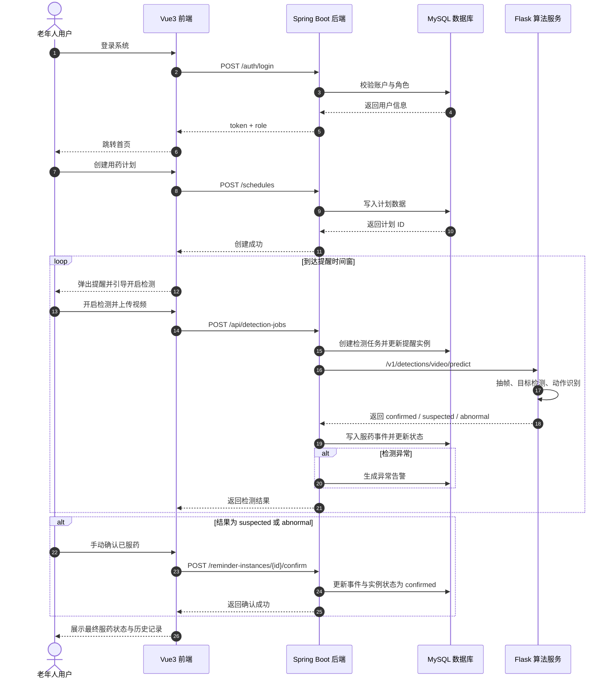
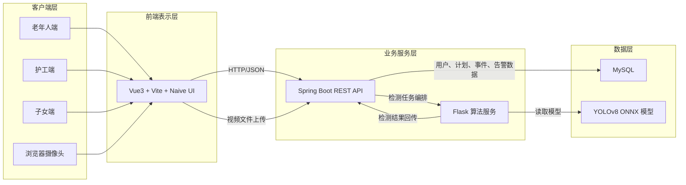
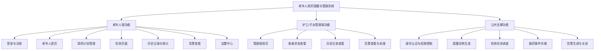
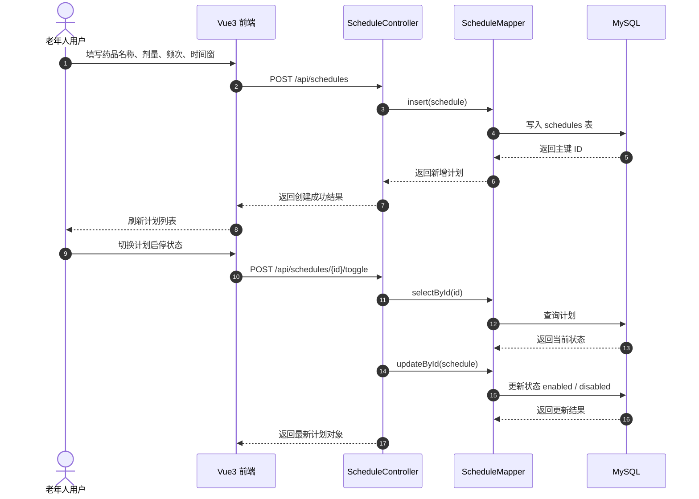
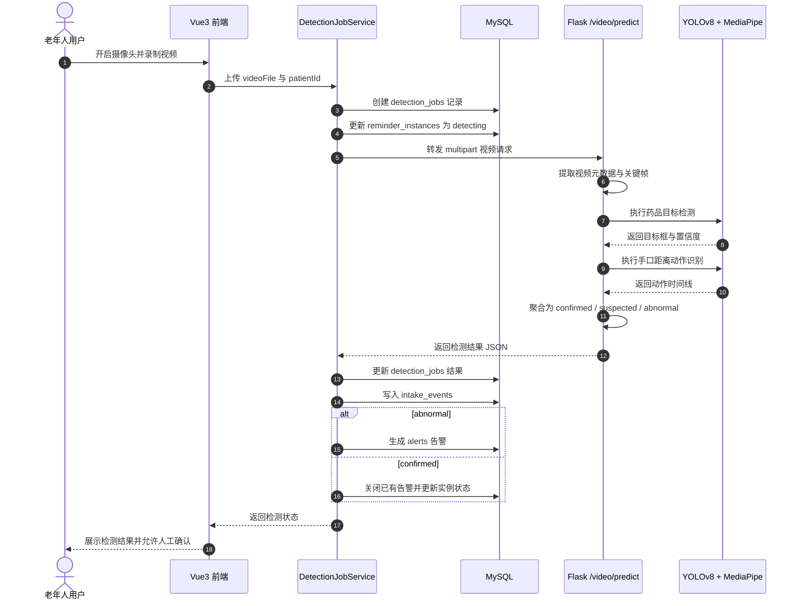

# 补充图表源文件

本文件提供论文当前缺失图表的 Mermaid 源码。后续如需导出为 SVG 或 PNG，可直接复制到 Mermaid Live Editor，或使用 `mmdc` 命令行导出。

## 图 3-3 系统业务时序图



## 图 4-1 系统技术架构图



## 图 4-2 系统功能层次结构图



## 图 4-3 用药计划模块时序图



## 图 4-4 目标检测模块时序图



## 导出建议

如果后续需要把上述 Mermaid 图导出为 SVG，可在项目根目录运行类似命令：

```bash
npx -y @mermaid-js/mermaid-cli -i input.mmd -o output.svg
```

如果你后面要我继续处理，我可以直接把这五张图导出成统一风格的 SVG 或 PNG。
